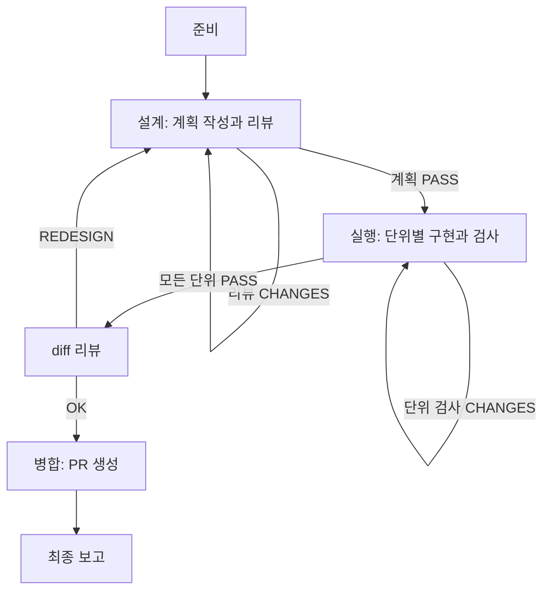

# 다중 모델 작업 하네스

## 개요

하네스는 호출 세션이 새 tmux 세션을 만들고, 그 안에서 실행되는 기획자 에이전트에게 모든 작업을 인계하면, 기획자가 코딩 작업을 유형별로 다른 모델의 에이전트에게 위임하고 계획-실행-검사-병합 루프를 완료될 때까지 돌리는 작업 방식이다.

호출 세션은 이 스킬을 호출한 세션이다. claude, codex, pi 중 무엇이어도 된다. 호출 세션은 작업 요약(brief.md)을 쓰고 새 tmux 세션을 만든 뒤, 그 안에 기획자(planner) 창을 띄워 전체 진행을 인계하고 이후 아무 작업도 하지 않는다. 설계, 구현, 검사, 병합, 루프 결정, 보고는 모두 새 세션 안에서 일어난다.

기획자는 새 tmux 세션 안에서 실행되는 에이전트다. claude, codex, pi 중 무엇이어도 된다. 기획자는 같은 세션의 서로 다른 윈도우에서 claude code cli, codex cli, pi cli로 역할 에이전트들을 실행한다. 각 역할은 임무 파일(mission)을 읽고, 산출물을 결과 파일(result)에 쓰고, 완료 마커(done)를 남긴다. 기획자는 파일로 상태를 추적하고 루프를 결정한다. 기획자가 tmux 윈도우에 직접 키 입력을 보내지 않는다.

## 대상 작업과 판단

다음 조건에 이 스킬을 쓴다.

- 리팩토링처럼 큰 맥락을 요구하거나, 계획-실행-리뷰가 완료될 때까지 반복되어야 하는 코딩 작업
- 여러 모델을 역할별로 나눠 위임하려는 작업
- 사용자가 다중 모델 하네스, 역할 분담, tmux 기반 위임을 요청한 경우

다음 조건에는 쓰지 않는다.

- 단순하고 맥락이 작은 변경. 설계-실행-검사 루프가 과하다.
- 사용자가 명시적으로 단일 세션 처리를 지시한 경우

작업 판단은 호출 세션이 한다. 작업이 작으면 이 스킬을 적용하지 않고 곧바로 처리한다.

## 역할과 모델

각 역할은 다음 표의 CLI와 모델로 실행한다. reasoning 수준은 설계자가 단위 난이도에 따라 높일 수 있다. 모델 ID와 CLI는 실행 환경에 따라 바뀔 수 있으므로 시작 절차에서 실제 값을 확인한다.

| 역할 | CLI | 모델 | reasoning 기본값 | 담당 |
| --- | --- | --- | --- | --- |
| 기획자 | claude (기본) | fable (기본) | medium | 전체 진행 관리, 역할 위임, 루프 결정, 최종 보고 |
| 설계자(계획) | codex | gpt-6-astra | medium | 계획 작성, diff 리뷰 |
| 설계자(계획 리뷰) | claude (기본) | fable (기본) | medium | 계획 검토와 판정. 저수준 작업이면 codex로 바뀐다 |
| 구현자 | pi | graphai01/deepseek-v4-flash | xhigh | 단위별 코드 수정 |
| 검사자 | pi | graphai01/deepseek-v4-flash | xhigh | 테스트 설계·작성·실행, 검증 |
| 병합자 | codex | gpt-6-astra | medium | 브랜치 병합, PR/이슈 작업 |

기획자는 호출 세션과 같은 수준의 모델을 쓰는 것이 좋다. 전체 진행을 조율해야 하므로 파일 조작과 스크립트 실행에 능한 CLI를 쓴다. 구현자와 검사자는 작업 단위마다 한 쌍씩 생성한다. 검사자는 구현자 세션 하나당 하나를 생성한다. 설계자는 계획 작성과 계획 리뷰가 모델이 다르다. 병합자는 설계자와 같은 수준의 모델을 쓰는 별개 세션이다.

### 모델 선택 규칙

저수준(low-level) 지식이 많이 필요한 작업은 codex를 claude보다 선호한다. 기획자는 시작 절차에서 작업 특성을 판단하고, 계획 리뷰에 쓸 모델을 정한다.

codex를 선택하는 저수준 신호는 다음과 같다.

- 시스템 프로그래밍. 커널, 드라이버, 임베디드, 펌웨어.
- 메모리와 성능. 수동 메모리 관리, 포인터, 최적화, 벤치마크, 프로파일링.
- 하드웨어 밀착. CPU, GPU, ISA, 어셈블리, SIMD.
- 런타임과 컴파일러 내부. 컴파일러, 링커, GC, 스케줄러, 가상 머신.
- 저수준 프로토콜과 포맷. 네트워크 스택, 직렬화, 파일 포맷, 암호화.
- C, C++, Rust, 어셈블리 같은 저수준 언어의 깊은 사용.

이 신호가 충분하지 않으면 claude를 쓴다. 판단은 기획자가 brief를 보고 하며, 결과와 근거를 state.log에 기록한다.

## 실행 구조

### tmux

이 스킬은 tmux 세션에서 역할 윈도우를 띄운다. Windows에서는 psmux가, macOS와 Linux에서는 표준 tmux가 실행된다. launch-role.ps1이 두 종류의 문법 차이를 처리하므로 기획자는 tmux 명령을 직접 다룰 필요가 없다.

수동으로 확인할 때 쓰는 명령은 다음과 같다.

| 작업 | 명령 |
| --- | --- |
| 세션 목록 | `tmux ls` |
| 윈도우 목록 | `tmux list-windows -t <세션>` |
| 붙어서 보기 | `tmux attach -t <세션>` |
| 화면 캡처 | `tmux capture-pane -t <세션>:<이름> -p` |
| 세션 종료 | `tmux kill-session -t <세션>` |

역할 윈도우는 실행 명령이 끝나면 닫힌다. launch-role.ps1이 시작 시 `remain-on-exit on`을 적용해 마지막 출력을 윈도우에 남긴다. 기획자는 윈도우에 직접 키 입력을 보내지 않는다.

### 파일 핸드오프

각 실행(run)은 실행 디렉터리에 상태를 둔다. 에이전트와 기획자는 파일로만 소통한다.

```
~/.do-it-runs/<run-id>/
  brief.md               # 작업 요약
  state.log              # 기획자의 상태 기록 (보고 자료의 원천)
  missions/<역할>.md     # 에이전트에게 주는 임무 파일
  results/<역할>.md      # 에이전트의 산출물
  results/<역할>.done    # 완료 마커, 내용은 종료 코드
  logs/<역할>.log        # 에이전트 콘솔 로그
  followups.md           # 범위 밖 작업 목록, 병합자가 이슈로 만든다
  wt/                    # 작업 단위 워크트리
  reports/report.md      # 최종 보고
```

역할 이름은 designer, reviewer, impl-1, insp-1, diff, merger처럼 정한다. 구현자와 검사자는 단위 번호를 붙인다.

완료 규약은 다음과 같다.

- 기획자가 `missions/<역할>.md`를 쓰고 `results/<역할>.done`을 지운다.
- launch-role.ps1이 역할 윈도우를 띄우고, run-role.ps1이 임무를 읽어 에이전트를 실행한다.
- 에이전트가 종료하면 run-role.ps1이 `results/<역할>.done`에 종료 코드를 쓰고 끝난다.
- 기획자가 wait-role.ps1로 완료 마커를 기다린다.
- 기획자가 `results/<역할>.md`(산출물)와 `.done`(종료 코드)을 읽어 다음 단계를 결정한다.
- 기획자가 산출물의 '범위 밖 발견' 항목을 `followups.md`에 모은다.

### 상태 기록

기획자는 단계가 바뀔 때마다 state.log에 한 줄씩 추가한다. 최종 보고는 이 기록을 바탕으로 작성한다. 기록 형식은 다음과 같다.

```
[시각] 단계: 내용
```

예: `[2026-03-25 09:31] DESIGN: designer 실행, 계획 OK`, `[2026-03-25 10:02] UNIT impl-1: 구현 완료, 검사 CHANGES 1회`.

## 시작 절차

호출 세션이 새 tmux 세션을 만들고 기획자에게 인계한다. 이후 진행은 기획자가 새 세션 안에서 한다.

### 호출 세션 준비

호출 세션은 다음까지만 한다.

1. 작업 파악. 사용자 요청이나 이슈를 읽고 작업 요약과 함께 목표와 범위 경계를 정리해 `brief.md`에 쓴다. 범위가 불분명하면 시작 전에 사용자에게 확인한다. 범위 밖 항목은 실행하지 않고 `followups.md`에 기록한다.
2. 저장소 확인. `git rev-parse --show-toplevel`로 저장소 경로와 base 브랜치를 정한다. base는 사용자가 지정하지 않으면 현재 브랜치로 한다.
3. 실행 디렉터리 생성. `~/.do-it-runs/<run-id>/`에 missions, results, logs, wt, reports 하위 디렉터리를 만든다. run-id는 `<슬러그>-YYYYMMDD-HHMM` 형식으로 한다.
4. tmux 세션 생성. 세션 이름은 `do-it-<슬러그>`로 하고 `tmux set -g remain-on-exit on`을 적용한다.
5. 기획자 임무 파일 작성. 템플릿 0을 채워 `missions/planner.md`에 쓴다.
6. 기획자 실행. `launch-role.ps1 -Role planner -Cli claude -Model fable -Effort medium`으로 새 세션 안에 기획자 창을 띄운다. -Cwd는 저장소 경로를 넘긴다.
7. 사용자에게 안내. "작업은 tmux 세션 `do-it-<슬러그>`에서 기획자가 진행한다"를 알리고, `tmux attach -t do-it-<슬러그>`로 붙어서 보는 방법을 안내한다.
8. 호출 세션은 이후 아무 작업도 하지 않는다. 루프 결정, 역할 실행, 보고는 모두 기획자의 몫이다.

### 기획자 진행

기획자는 새 세션 안에서 다음을 시작한다.

1. `~/.do-it-runs/<run-id>/`의 `brief.md`와 자신의 임무 `missions/planner.md`를 읽는다.
2. CLI와 모델 검증. `codex --version`, `claude --version`, `pi --list-models deepseek`로 실제 값을 확인하고 역할과 모델 표를 갱신한다.
3. 작업 특성 판단. brief를 보고 저수준 지식 필요도를 판단해 계획 리뷰에 쓸 모델을 정한다. 모델 선택 규칙을 따른다. 판단 결과와 근거를 state.log에 기록한다.
4. state.log에 시작을 기록하고 아래 작업 흐름을 따른다.

모든 스크립트 호출은 다음 형태로 한다.

```powershell
pwsh -NoProfile -ExecutionPolicy Bypass -File <스킬 디렉터리>/scripts/<스크립트>.ps1 <인자...>
```

`-ExecutionPolicy Bypass`는 Windows에서만 적용된다. macOS와 Linux의 pwsh는 실행 정책을 적용하지 않아 이 인자를 무시한다.

스크립트는 이 스킬 디렉터리(SKILL.md가 위치한 곳)의 `scripts/`에 있다. 설치 위치는 하네스별로 다르다. pi는 `~/.agents/skills/do-it`, claude는 `~/.claude/skills/do-it`, codex는 `~/.codex/skills/do-it`다.

## 작업 흐름

이 흐름은 기획자가 새 tmux 세션 안에서 실행한다. 호출 세션은 실행하지 않는다.

전체 흐름은 다음 상태 기계를 따른다.



### 0단계, 준비

시작 절차를 따른다.

### 1단계, 설계

설계는 계획 작성과 계획 리뷰로 구성된다.

1. 설계자 임무 파일 작성. 템플릿 1을 채워 `missions/designer.md`에 쓴다. 설계자는 codex astra medium으로 실행한다. 계획은 brief의 목표와 범위 안에서 수립한다.
2. 설계자 실행. `launch-role.ps1 -Role designer -Cli codex -Model gpt-6-astra -Effort medium`으로 실행하고 완료를 기다린다. 계획은 `results/designer.md`에 담긴다.
3. 계획 리뷰어 임무 파일 작성. 템플릿 2를 채워 `missions/reviewer.md`에 쓴다. 리뷰어 모델은 시작 절차에서 정한 값을 쓴다.
4. 계획 리뷰어 실행. claude면 `-Cli claude -Model fable -Effort medium`, codex면 `-Cli codex -Model gpt-6-astra -Effort medium`으로 실행한다. 판정(PASS/CHANGES)을 `results/reviewer.md`에서 읽는다.
5. CHANGES면 리뷰어의 수정 요구를 담아 설계자 임무를 다시 작성하고 2로 돌아간다. 설계 루프는 최대 3회다.
6. PASS면 설계가 정해졌다. 설계자가 결정한 작업 단위 수만큼 다음 단계를 진행한다.

설계자가 작업 단위 수를 결정하는 기준은 다음과 같다.

- 난이도가 쉽고 맥락이 적으면 단일 단위로 한다.
- 맥락이 크면 관계 있는 것끼리 묶어 둘 이상의 단위로 나누고 구현자 수를 조절한다.
- 각 단위는 독립적으로 구현되고 검사될 수 있어야 한다.
- 단위 난이도에 따라 reasoning 수준을 높이는 것을 허용한다.

### 2단계, 실행

각 단위 u에 대해 다음을 반복한다.

1. 구현자 워크트리와 브랜치 생성. base에서 `impl/<task>-<u>` 브랜치를 만들고 워크트리를 추가한다. make-worktree.ps1을 쓴다.
2. 구현자 임무 파일 작성. 템플릿 3을 채워 `missions/impl-<u>.md`에 쓴다. 구현자는 pi deepseek xhigh로 실행한다.
3. 구현자 실행. 완료 후 `results/impl-<u>.md`에서 구현 결과와 커밋 목록을 읽는다.
4. 검사자 워크트리와 브랜치 생성. `impl/<task>-<u>`에서 `insp/<task>-<u>` 브랜치를 만들고 워크트리를 추가한다.
5. 검사자 임무 파일 작성. 템플릿 4를 채워 `missions/insp-<u>.md`에 쓴다. 검사자는 pi로 실행한다.
6. 검사자 실행. 판정(PASS/CHANGES)을 `results/insp-<u>.md`에서 읽는다.
7. CHANGES면 검사자의 피드백을 담아 구현자 임무를 다시 작성하고 3으로 돌아간다. 검사자도 다시 실행한다. 단위 루프는 최대 3회다.
8. PASS면 단위가 완료된다.

단위 완료 기준은 구현자가 구현을 끝내고 검사자가 문제없다고 통과시키는 것이다.

### 3단계, 루프 결정

모든 단위가 통과하면 다음을 수행한다.

1. 설계자 diff 리뷰 임무 파일 작성. 템플릿 5를 채워 `missions/diff.md`에 쓴다. 모든 단위 브랜치 목록을 담는다.
2. 설계자 실행. codex astra medium으로 실행한다. 판정(OK/REDESIGN)을 `results/diff.md`에서 읽는다.
3. REDESIGN이면 1단계로 돌아가 계획을 개정한다. 전체 루프 횟수를 state.log에 기록한다. 전체 루프는 최대 3회다.
4. OK면 병합자에게 줄 인계 메모를 `results/diff.md`에서 확보한다.

### 4단계, 병합

1. 통합 브랜치 생성. base에서 `integ/<task>` 브랜치를 만든다.
2. 병합자 임무 파일 작성. 템플릿 6을 채워 `missions/merger.md`에 쓴다. 설계자의 인계 메모, 단위 브랜치 목록, `followups.md` 내용을 담는다.
3. 병합자 실행. codex astra medium으로 실행한다. 병합, 충돌 해결, 최종 빌드와 테스트, PR 생성을 수행한다.
4. `results/merger.md`에서 병합 결과, PR 링크, 생성한 이슈를 읽는다.

병합자는 절대 PR을 병합하지 않는다. PR 생성과 이슈 생성만 허용한다.

### 5단계, 최종 보고

기획자는 실행 디렉터리와 state.log를 읽고 `reports/report.md`를 작성한다. 보고 항목은 최종 보고 절을 따른다. 보고를 마치면 사용자에게 결과를 안내하고, 사용자가 확인할 수 있게 tmux 세션을 남겨 둔다.

## 하드 규칙

다음 규칙은 어떤 상황에서도 어기지 않는다.

- 호출 세션은 작업하지 않는다. 호출 세션은 brief 작성, tmux 세션 생성, 기획자 실행과 인계까지만 한다. 설계, 구현, 검사, 병합, 루프 결정, 보고는 모두 새 세션 안에서 기획자와 역할들이 한다.
- PR 병합 금지. `gh pr merge`를 실행하지 않는다. PR 생성(`gh pr create`)과 이슈 생성(`gh issue create`)은 허용한다.
- 메인 작업 디렉터리 수정 금지. 모든 코드 변경은 워크트리에서 한다.
- 구현자는 항상 새 워크트리와 브랜치에서 작업한다. 수정은 surgical하게 최소한으로 하고, 커밋은 하나의 논리적 변경마다 잘게 쪼갠다.
- 한국어 산문에는 sucks 스킬을 적용한다. 커밋 메시지 본문, PR 본문, 이슈 본문, 주석, 산출물이 대상이다. sucks 스킬은 설치된 SKILL.md에서 읽는다.
- 전역 규칙(AGENTS.md)과 프로젝트 규칙을 따른다.
- 범위 규율. 최초에 할당된 목표(brief의 범위)를 명확히 달성한다. 범위 밖 작업은 실행하지 않고 `followups.md`에 기록해 별도 이슈로 남긴다.
- 워크트리를 삭제하기 전에 junction을 해제한다. 전역 규칙의 안전한 junction 제거 절차를 따른다.

## 역할별 임무 파일 템플릿

템플릿의 `<...>` 자리를 기획자가 채운다. 임무 파일은 에이전트가 직접 읽을 수 있는 완결된 지시여야 한다.

### 템플릿 0, 기획자 전체 진행

```markdown
# 역할, 기획자

당신은 이 작업의 기획자다. 새 tmux 세션 안에서 전체 진행을 관리한다. 호출 세션은 더 이상 개입하지 않는다. 설계, 리뷰, 구현, 검사, diff, 병합, 최종 보고까지 당신이 조율한다.

## 작업 개요

<brief.md 내용>

## 저장소

- 경로: <저장소 경로>
- 기준 브랜치: <base>
- 참고 문서: 전역 규칙(AGENTS.md), 프로젝트 규칙, 기존 코드베이스 관행

## 스크립트

역할 창은 다음 스크립트로만 만든다. tmux 명령을 직접 조립하지 않는다.

- 스크립트 경로: <스킬 디렉터리>/scripts/
- 실행: `pwsh -NoProfile -ExecutionPolicy Bypass -File <스크립트>.ps1 <인자...>` (-ExecutionPolicy Bypass는 Windows 전용)
- 세션 이름: do-it-<슬러그>. 이미 생성돼 있고, 당신이 새 윈도우를 추가한다.
- 역할 완료는 wait-role.ps1로 마커를 기다리고, 결과는 results/<역할>.md에서 읽는다.

## 진행 규칙

- 작업 특성을 판단해 계획 리뷰에 쓸 모델을 정한다. 모델 선택 규칙을 따른다. 판단과 근거를 state.log에 기록한다.
- 단계가 바뀔 때마다 state.log에 한 줄씩 기록한다.
- 역할에 직접 키 입력을 보내지 않는다. 파일로만 소통한다.
- 범위 밖 작업은 실행하지 않고 followups.md에 기록한다.
- PR 병합(`gh pr merge`)은 절대 하지 않는다.
- 한국어 산문에는 sucks 스킬을 적용한다.

## 진행 순서

1. 계획. 템플릿 1을 채워 missions/designer.md를 쓰고 설계자를 실행해 계획을 받는다. 템플릿 2로 계획 리뷰를 돌린다. CHANGES면 수정 요구를 담아 다시 설계한다. 설계 루프는 최대 3회.
2. 실행. 계획의 각 단위 u에 대해 템플릿 3으로 구현자(impl-<u>)를, 템플릿 4로 검사자(insp-<u>)를 실행한다. CHANGES면 구현-검사 루프를 다시 돈다. 단위 루프는 최대 3회.
3. diff 리뷰. 템플릿 5를 채워 missions/diff.md를 쓰고 설계자로 전체 diff를 리뷰한다. REDESIGN이면 1로 돌아간다. 전체 루프는 최대 3회.
4. 병합. 템플릿 6으로 병합자를 실행해 통합 브랜치 병합과 PR/이슈 생성을 한다.
5. 최종 보고. 실행 디렉터리와 state.log를 읽고 reports/report.md를 작성한다.

## 산출물

- state.log: 단계별 상태 기록
- reports/report.md: 최종 보고 (최종 보고 절을 따른다)
```

### 템플릿 1, 설계자 계획 작성

```markdown
# 역할, 설계자(계획 작성)

당신은 작업의 설계자다. 산출물은 계획 문서다. 코드를 수정하지 않는다.

## 작업 개요

<brief.md 내용>

## 저장소

- 경로: <저장소 경로>
- 기준 브랜치: <base>
- 참고 문서: 전역 규칙(AGENTS.md), 프로젝트 규칙, 기존 코드베이스 관행

## 설계 기준

다음을 적용해 계획을 작성한다.

- 기존 코드베이스 관행을 먼저 읽고 따른다.
- SOLID 원칙, 응집도와 결합도 원칙, 디자인 패턴, 오컴의 면도날.
- 전역 규칙과 프로젝트 규칙.
- 작업 단위 분해. 난이도가 쉽고 맥락이 적으면 단일 단위로 한다. 맥락이 크면 관계 있는 것끼리 묶어 둘 이상의 단위로 나누고 구현자 수를 조절한다. 각 단위는 독립적으로 구현되고 검사될 수 있어야 한다.
- 단위 난이도에 따라 reasoning 수준을 조정한다. 기본은 medium이며 어려운 단위는 높인다.
- 계획은 brief의 목표와 범위 안에서 수립한다. 범위 밖 작업을 발견하면 계획에 넣지 말고 계획 문서의 '범위 밖 후보'에만 적는다.

## 계획 문서 구조

최종 응답 메시지에 전체 계획을 마크다운으로 담는다.

1. 배경과 목표. brief의 목표와 범위 경계를 그대로 반영한다.
2. 기존 코드베이스 분석과 채택할 관행
3. 설계 결정과 근거. SOLID, 응집도와 결합도, 패턴, 오컴의 면도날을 각각 적용한 이유.
4. 작업 단위 분해. 단위마다 범위, 대상 파일, 접근 방식, 구현자의 reasoning 수준, 수용 기준.
5. 구현 순서와 의존성
6. 검사 기준. 검사자가 확인할 항목.
7. 위험과 대응
8. 범위 밖 후보. 이번 작업에 포함하지 않는 관련 작업 목록.

## 산출물

최종 응답 메시지에 계획 전체를 담는다. 파일 저장은 필요 없다.
```

### 템플릿 2, 계획 리뷰

```markdown
# 역할, 설계자(계획 리뷰)

당신은 설계자가 작성한 계획을 리뷰한다. 코드를 수정하지 않는다.

## 검토 대상 계획

<results/designer.md 내용>

## 작업 개요

<brief.md 내용>

## 리뷰 기준

- 요구사항 완전성
- SOLID, 응집도와 결합도, 디자인 패턴, 오컴의 면도날 준수
- 전역 규칙과 프로젝트 규칙 준수
- 작업 단위 분해의 적절성. 단일 대 다중, 묶음, 구현자 수.
- 리스크와 빠진 고려

## 판정

다음 파일에 마크다운으로 저장한다: <results/reviewer.md>

# 판정: PASS 또는 CHANGES

## 근거

## 수정 요구사항

CHANGES일 때만. 계획 문서의 어떤 부분을 어떻게 바꿔야 하는지 구체적으로.
```

### 템플릿 3, 구현자

```markdown
# 역할, 구현자(단위 <u>)

당신은 작업 단위 <u>의 구현자다. 워크트리에서 코드를 수정한다.

## 작업 단위 계획

<results/designer.md의 단위 <u> 부분>

## 작업 개요

<brief.md 내용>

## 저장소

- 워크트리 경로: <wt 경로>, 현재 디렉터리가 곧 워크트리다.
- 브랜치: impl/<task>-<u>
- 기준: <base>

## 수행 규칙

- 현재 워크트리에서만 작업한다. 수정은 surgical하게 필요 최소한으로 한다.
- 커밋은 잘게 쪼갠다. 하나의 커밋은 하나의 논리적 변경이다. 커밋 메시지는 명확하게 쓴다.
- 한국어 산문에는 설치된 sucks 스킬의 SKILL.md를 읽고 적용한다
- 전역 규칙(AGENTS.md)과 프로젝트 규칙을 따른다.
- 계획의 수용 기준을 만족하는지 확인한다.
- brief의 범위 밖 작업은 구현하지 않는다. 발견하면 산출물의 '범위 밖 발견'에 기록한다.
- 테스트는 작성하지 않는다. 테스트는 검사자의 몫이다. 단, 기존 테스트를 깨지 않아야 한다.

## 산출물

작업이 끝나면 다음 파일에 마크다운으로 저장한다: <results/impl-<u>.md>

# 구현 결과

## 변경 요약
## 커밋 목록 (해시와 메시지)
## 수용 기준 충족 여부
## 범위 밖 발견 (이번 작업에 포함하지 않은 관련 항목)
## 검사자에게 알릴 사항 (변경 범위, 주의점, 빌드와 테스트 실행 방법)
```

### 템플릿 4, 검사자

```markdown
# 역할, 검사자(단위 <u>)

당신은 작업 단위 <u>의 검사자다. 구현자의 변경을 검증하고 테스트를 설계하고 작성하고 실행한다.

## 구현 결과

<results/impl-<u>.md 내용>

## 작업 단위 계획

<results/designer.md의 단위 <u> 부분>

## 작업 개요

<brief.md 내용>

## 저장소

- 워크트리 경로: <insp wt 경로>, 현재 디렉터리가 곧 워크트리다.
- 브랜치: insp/<task>-<u>, 구현 브랜치 impl/<task>-<u>를 기준으로 만들었다.
- 검증 대상 diff: `git diff <base>...impl/<task>-<u>`

## 수행 규칙

- 구현자의 변경이 계획과 기존 요구사항을 충족하는지 확인한다.
- 검증은 brief의 목표와 범위 기준으로 한다. 범위 밖 발견은 판정의 '범위 밖 발견'에 기록한다.
- 테스트를 설계하고 작성한다. FIRST 원칙, AAA 패턴, 프로젝트 언어에 맞는 테스트 방법론을 적용한다.
- 기존 테스트를 포함해 전체 테스트를 실행한다.
- 문제를 발견하면 구체적으로 적는다. 어떤 파일과 동작이 요구사항을 어기고, 어떤 테스트가 실패하고, 어떻게 고쳐야 하는지.
- 한국어 산문에는 설치된 sucks 스킬의 SKILL.md를 읽고 적용한다
- 작성한 테스트는 검사자 워크트리의 브랜치에 커밋한다.

## 판정

다음 파일에 마크다운으로 저장한다: <results/insp-<u>.md>

# 판정: PASS 또는 CHANGES

## 검증 내용
## 작성하고 실행한 테스트
## 문제 (CHANGES일 때, 구현자에게 전달할 구체적 피드백)
## 범위 밖 발견 (이번 작업에 포함하지 않은 관련 항목)
```

### 템플릿 5, diff 리뷰

```markdown
# 역할, 설계자(diff 리뷰)

모든 단위가 검사를 통과했다. 전체 변경을 검토하고 루프를 계속할지 판정한다. 코드를 수정하지 않는다.

## 계획

<results/designer.md 내용>

## 작업 개요

<brief.md 내용>

## 검토 대상

모든 단위 브랜치와 그 diff.

- 브랜치: impl/<task>-1, insp/<task>-1, ... (전체 목록)
- 저장소 경로: <저장소 경로>
- base: <base>

각 브랜치의 변경은 `git diff <base>...<브랜치>`로 확인한다.

## 판정 기준

- brief 목표 달성. 최초 할당된 목표가 범위 안에서 달성됐는지.
- 범위 준수. 계획과 brief의 범위를 벗어난 변경이 없는지. 벗어난 변경은 문제로 본다.
- 계획 대비 실제 구현의 차이
- 단위 간 통합 문제, 충돌, 중복
- 요구사항 커버리지
- 잔여 결함, 미완성, 디버그 잔재
- 코드 품질

## 판정

최종 응답 메시지에 다음을 담는다.

# 판정: OK 또는 REDESIGN

## 근거
## 재설계 요구사항 (REDESIGN일 때, 어떤 부분을 어떻게 바꿔야 하는지)
## 병합자 인계 메모 (OK일 때)

- 계획 대비 실제 결과 요약
- 병합 순서와 주의점
- 최종 확인 사항
```

### 템플릿 6, 병합자

```markdown
# 역할, 병합자

당신은 모든 단위의 결과를 하나로 병합하고 PR과 이슈 작업을 수행한다. 설계자와 같은 수준의 모델로 동작하는 별개 세션이다.

## 인계 메모

<results/diff.md의 병합자 인계 메모 부분>

## 작업 개요

<brief.md 내용>

## 저장소

- 저장소 경로: <저장소 경로>
- 통합 브랜치: integ/<task>, base <base>에서 만들었다.
- 병합할 브랜치: impl/<task>-1, insp/<task>-1, ... (전체 목록)

## 수행

- 통합 브랜치에서 모든 단위 브랜치를 순서대로 병합한다. 충돌은 최소 변경으로 해결한다.
- 최종 빌드와 테스트를 실행하고 통과를 확인한다.
- PR을 생성한다. `gh pr create`는 허용된다. PR은 brief의 범위 안에서만 구성한다.
- `followups.md`의 범위 밖 항목을 이슈로 생성한다. `gh issue create`는 허용된다.
- PR 병합은 절대 하지 않는다. `gh pr merge`는 금지다.
- 한국어 산문에는 설치된 sucks 스킬의 SKILL.md를 읽고 적용한다

## 산출물

다음 파일에 마크다운으로 저장한다: <results/merger.md>

# 병합 결과

## 병합한 브랜치
## 충돌 해결 내역
## 최종 검증 (빌드와 테스트)
## PR 링크
## 생성한 이슈
## 후속 작업
```

## 스크립트

스크립트는 이 스킬 디렉터리의 `scripts/`에 있다. 기획자는 `<스킬 디렉터리>/scripts/<스크립트>.ps1`을 `pwsh -NoProfile -ExecutionPolicy Bypass -File`로 호출한다. `-ExecutionPolicy Bypass`는 Windows 전용이며 macOS와 Linux에서는 무시된다.

### launch-role.ps1

역할 윈도우를 tmux에 띄운다. 같은 이름의 기존 윈도우를 지우고 새로 만든다. CLI의 네이티브 진입점(npm 래퍼를 우회한 node + cli.js, claude.exe)을 해석해 절대 경로로 run-role.ps1에 넘긴다. 인자는 다음과 같다.

| 인자 | 설명 |
| --- | --- |
| -Session | tmux 세션 이름 |
| -Role | 역할 이름 (planner, designer, reviewer, impl-1, insp-1, diff, merger) |
| -Cli | codex, claude, pi 중 하나 |
| -Model | 모델 ID 또는 별칭 |
| -Effort | reasoning 수준 (codex와 claude) |
| -Cwd | 에이전트 작업 디렉터리 |
| -Mission | 임무 파일 경로 |
| -Result | 산출물 파일 경로 |
| -Log | 콘솔 로그 경로 |

예:

```powershell
pwsh -NoProfile -ExecutionPolicy Bypass -File <스킬 디렉터리>/scripts/launch-role.ps1 -Session do-it-demo -Role designer -Cli codex -Model gpt-6-astra -Effort medium -Cwd <저장소 경로> -Mission ~/.do-it-runs/<run-id>/missions/designer.md -Result ~/.do-it-runs/<run-id>/results/designer.md -Log ~/.do-it-runs/<run-id>/logs/designer.log
```

### run-role.ps1

역할 윈도우 안에서 실행되는 에이전트 러너다. launch-role.ps1이 인자로 넘긴다. 임무 파일을 읽어 CLI를 실행하고, 산출물 파일과 완료 마커를 쓴다. 기획자가 직접 호출하지 않는다.

### wait-role.ps1

완료 마커를 기다린다. 인자는 -Done(마커 경로), -TimeoutSec(기본 120), -PollSec(기본 5)다. 마커가 나타나면 종료 코드를 출력하고, 시간 초과면 TIMEOUT을 출력하고 코드 1로 끝난다. 기획자는 120초 청크로 반복 호출하고, 청크 사이에 로그 꼬리를 읽어 진행을 파악한다.

예:

```powershell
pwsh -NoProfile -ExecutionPolicy Bypass -File <스킬 디렉터리>/scripts/wait-role.ps1 -Done ~/.do-it-runs/<run-id>/results/designer.done -TimeoutSec 120
```

### make-worktree.ps1

워크트리와 브랜치를 만든다. 인자는 -Repo(저장소 경로), -Branch(새 브랜치), -Path(워크트리 경로), -Base(기준 ref, 선택)다.

```powershell
pwsh -NoProfile -ExecutionPolicy Bypass -File <스킬 디렉터리>/scripts/make-worktree.ps1 -Repo <저장소 경로> -Branch impl/demo-1 -Path ~/.do-it-runs/<run-id>/wt/1 -Base main
```

워크트리를 만든 뒤에는 전역 규칙에 따라 gitignore 대상 파일을 처리한다. `.env`는 심링크, node_modules는 재설치, 데이터 파일은 복사, 빌드 산출물은 무시한다.

## 실패와 에스컬레이션

- 역할 타임아웃. 기본 30분이다. wait-role.ps1을 120초 청크로 반복하고, 청크 사이에 로그를 확인한다. 총 대기가 30분을 넘으면 중단하고 사용자에게 상황과 선택지를 알린다.
- 루프 한계. 설계 루프 3회, 단위 루프 3회, 전체 루프 3회가 기본이다. 한계를 넘으면 무한 반복을 멈추고 사용자에게 알린다.
- 에이전트 실패. 종료 코드가 0이 아니거나 산출물이 비면 로그와 결과 파일로 원인을 판단한다. 재시도 가능하면 임무를 다시 주고, 아니면 사용자에게 알린다.
- 임시 판단. 기획자가 스스로 판단하기 어려운 분기(작업 방향, 리스크 허용)는 사용자에게 결정을 요청한다.

## 최종 보고

기획자는 실행 디렉터리와 state.log를 읽고 `reports/report.md`를 작성한다. 보고 항목은 다음과 같다.

- 작업 개요. brief, run-id, base 브랜치.
- 역할 구성. 각 역할을 어떻게 만들었는지. 어떤 CLI와 모델, 어떤 tmux 윈도우에서 돌았는지.
- 모델 선택. 계획 리뷰에 쓴 모델과 그 판단 근거.
- 역할별 활동. 설계자, 계획 리뷰어, 구현자, 검사자, 병합자가 각각 무엇을 했는지.
- 루프 기록. 설계 루프, 단위별 구현-검사 루프, 전체 루프의 횟수와 각 판정.
- 단위별 결과. 수용 기준 충족 여부, 최종 diff 리뷰 판정.
- 목표 달성. brief의 목표가 범위 안에서 달성됐는지.
- 병합 결과. PR 링크, 생성한 이슈.
- 범위 밖 작업. followups.md 항목과 생성한 이슈.
- 잔여 위험과 후속 작업.

보고를 마치면 사용자에게 결과를 요약하고, tmux 세션을 붙어서 확인하는 방법을 안내한다. 사용자가 확인을 마치면 세션을 정리한다. 정리 순서는 워크트리 junction 해제, `git worktree remove`, `tmux kill-session -t do-it-<슬러그>`다.

## 자주 틀리는 지점

- 호출 세션이 작업에 개입하는 실수. 호출 세션은 brief 작성과 기획자 실행까지만 하고, 이후 루프 결정이나 역할 실행에 손대지 않는다.
- tmux 문법을 직접 조립하는 실수. launch-role.ps1이 psmux(Windows)와 표준 tmux(macOS/Linux)의 문법 차이를 처리한다. 기획자는 스크립트를 통해서만 윈도우를 만든다.
- 경로에 공백이 들어간 인자를 토큰으로 넘기는 실수. 실행 디렉터리와 워크트리 경로는 공백 없는 경로를 쓴다.
- PR을 병합하는 실수. 절대 `gh pr merge`를 실행하지 않는다.
- 검사 단계를 생략하고 바로 병합하는 실수. 모든 단위가 검사 PASS가 되어야 다음 단계로 간다.
- 루프 한계 없이 무한 반복하는 실수. 각 루프의 한계를 지키고 초과 시 사용자에게 알린다.
- 작업이 범위 밖으로 발산하는 실수. brief의 목표와 범위를 벗어나면 실행하지 않고 followups.md에 기록한다.
- 완료 마커는 있는데 산출물이 없는 경우. 기획자는 판정을 읽기 전에 산출물 파일 존재를 확인한다.
- 계획 리뷰 모델을 판단 없이 claude로 고정하는 실수. 시작 절차에서 작업 특성을 먼저 판단한다.
- 메인 작업 디렉터리를 수정하는 실수. 모든 코드 변경은 워크트리에서 일어난다.
